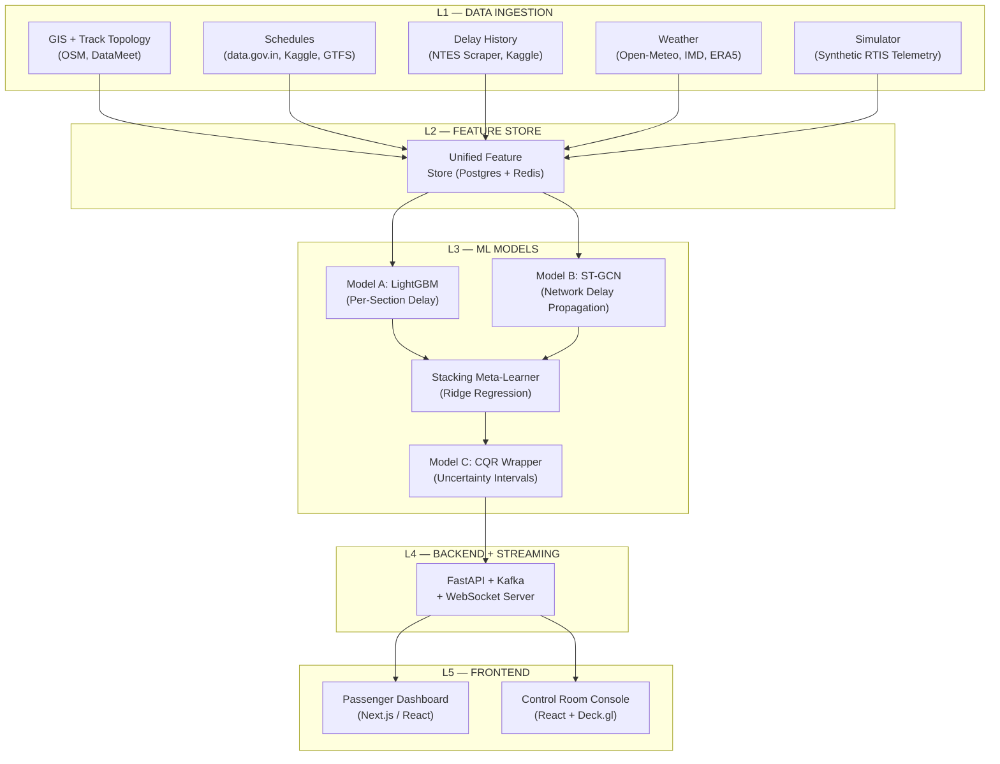
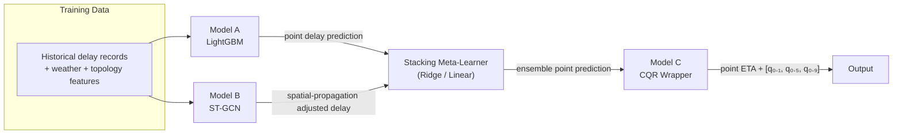

# Master Build Plan — Dynamic ETA for Indian Railways

> **From Phase 0 Research → Fully Functioning Application**
> Maps every data source, model, and component into a concrete build path.

---

## The Big Picture (5 Layers)



---

## L1 — Data Ingestion: What to Pull & How

### 1.1 GIS / Track Topology (Static — run once, update monthly)

| What | Source from LINKS.md | Tool/Lib | Output |
|:--|:--|:--|:--|
| Track geometry (edges) | [Geofabrik India PBF](https://download.geofabrik.de/asia/india-latest.osm.pbf) | `osmium` → `pyrosm` | GeoJSON of all rail ways with `gauge`, `tracks`, `electrified`, `maxspeed` tags |
| Station nodes + coords | [DataMeet Railways](https://github.com/datameet/railways) + [Kaggle IR Stations](https://www.kaggle.com/datasets/mansiaggarwal88/indian-railway-stations-and-routing-network) | `geopandas` | CSV: `station_code, name, lat, lon, zone, division, junction_degree` |
| Elevation gradient | [Copernicus DEM 30m (AWS S3)](https://registry.opendata.aws/copernicus-dem/) — **no auth needed** | `rasterio` + `richdem` | Gradient (m/km) per block section |
| Network graph | [OSM2Rail](https://github.com/jiawei92/OSM2Rail) or [IR Network Graph](https://github.com/AyushiKashyapp/indian_railways_network) | `osmnx` → `NetworkX` | Adjacency matrix **A** for the GNN, edge weights = section distance |

**Pipeline:** Download PBF → `osmium tags-filter` → `pyrosm` parse → spatial join stations to edges → compute section distances, junction degrees, track counts → store in **Postgres + PostGIS**.

### 1.2 Schedules (Static — refresh quarterly)

| What | Source from LINKS.md | Output |
|:--|:--|:--|
| Pan-India timetable | [data.gov.in IR Timetable](https://data.gov.in/catalog/indian-railways-time-table-trains) (11K trains, 186K stops) | `train_no, station_code, seq_no, arrival, departure, day, distance` |
| GTFS feed | [indianrailways-gtfs](https://github.com/Neo2308/indianrailways-gtfs) + [railpull](https://github.com/shwetankg07/railpull) | `stops.txt`, `stop_times.txt`, `routes.txt`, `calendar.txt` |
| Supplementary | [Kaggle — CRIS OGD Cleaned](https://www.kaggle.com/datasets/colearninglounge/indian-railway-dataset) (11,114 trains) | Cross-validate stop sequences |

**Derived features from schedules:** scheduled headway, scheduled dwell time, timetable recovery slack, train priority rank (from train number ranges), cumulative trip progress.

### 1.3 Historical Delay Data (The training signal)

| What | Source from LINKS.md | Records | Use |
|:--|:--|:--|:--|
| **Primary scrape** | [NTES Scraper](https://enquiry.indianrail.gov.in/mntes/) via [`ntes-client`](https://pypi.org/project/ntes-client/) | Continuous (cron every 5 min for pilot trains) | Station-by-station actual vs scheduled — **this is the ground truth** |
| Kaggle delays (Golden Quad) | [Antareep Dey dataset](https://www.kaggle.com/datasets/antareepdey/indian-railway-delay-dataset) | 2018–2022 | Historical training set |
| Kaggle delays 2025 | [Naijil Aji dataset](https://www.kaggle.com/datasets/naijilaji/indian-railways-train-delays-dataset-2025) | 1,900+ combos | Recent validation |
| Kaggle competition | [Predict Train Delay](https://www.kaggle.com/competitions/indian-railways-predict-train-delay) | 1.5M records | Pre-labeled binary classification benchmark |

> [!IMPORTANT]
> **NTES scraping is the most critical data pipeline.** Kaggle datasets are static snapshots. You need the scraper running for weeks to accumulate enough per-section actual arrival/departure timestamps across seasons.

**Scraper setup:** `ntes-client` + Playwright fallback → rate limit 1 req/3s → store raw JSON → nightly ETL to Postgres `delay_events(train_no, date, station_code, sched_arr, actual_arr, delay_min)`.

### 1.4 Weather (Dynamic — fetch hourly)

| What | Source from LINKS.md | Tool | Key Variables |
|:--|:--|:--|:--|
| **Primary (operational)** | [Open-Meteo Historical API](https://open-meteo.com/en/docs/historical-weather-api) — **no key, 10K/day** | `openmeteo-requests` | `visibility`, `precipitation`, `weather_code` (WMO 45/48=fog), `temperature_2m`, `wind_speed_10m` |
| Historical backfill | [ERA5 via Copernicus CDS](https://cds.climate.copernicus.eu/) | `cdsapi` + `xarray` | Deep reanalysis for training set weather alignment |
| India-specific rainfall | [IMD Gridded](https://dsp.imdpune.gov.in/) | `imdlib` | Monsoon rainfall ground truth |
| Real-time forecast | [Open-Meteo Forecast](https://api.open-meteo.com/v1/forecast) — **no key** | `openmeteo-requests` | 16-day ahead forecast for ETA inference |

**Pipeline:** For each station lat/lon → hourly Open-Meteo query → join to delay records on `(station, rounded_hour)` → compute `fog_severity_index`, seasonal regime flag.

### 1.5 Synthetic Telemetry Simulator

Since RTIS/GPS data is restricted (CRIS internal), build a **replay simulator** to generate training data and test the streaming pipeline.

| What | Source from LINKS.md | Use |
|:--|:--|:--|
| Simulator framework | [rail-delay-simulator (AAAI-26)](https://github.com/orailix/rail-delay-simulator) — fork and adapt | GPU-parallelized block-section traversal |
| Supplement | [Eclipse SUMO Rail](https://github.com/eclipse-sumo/sumo) for signal/block logic reference | Validate simulator physics |
| Track topology input | Your PostGIS network graph from L1.1 | Feed real topology into simulator |

The simulator uses the mathematical model from Phase 0 §6: base section time + congestion + weather + priority wait + noise → generate 30-second GPS pings along routes.

---

## L2 — Feature Store

Everything from L1 flows into a **unified feature store**. Two tiers:

| Tier | Store | Content | Access Pattern |
|:--|:--|:--|:--|
| **Static features** | **PostgreSQL + PostGIS** | Track topology, station metadata, schedules, historical delay stats | Batch reads during training; cached in Redis for inference |
| **Dynamic features** | **Redis (time-series)** | Current delay, lag delays, rolling delay trend, live weather, section occupancy | Sub-second reads during real-time inference |

### Feature Computation (from Phase 0 §4)

| Category | Features | How Computed |
|:--|:--|:--|
| **Spatial** (static) | track capacity, section distance, junction degree, electrification, max speed, gauge, elevation gradient, zone/division | From PostGIS queries on OSM data + DEM |
| **Temporal** (static per trip) | train priority, scheduled headway, ToD/DoW (cyclical encoded), dwell time, recovery slack, trip progress | From GTFS/timetable at trip creation |
| **Dynamic telemetry** (real-time) | current delay $d_k$, delay delta $\Delta d_k$, rolling trend, section running time deviation, velocity ratio, dwell anomaly, upstream train delay, lag features ($d_{k-1}, d_{k-2}, d_{k-5}$) | Computed on each new NTES/GPS event → pushed to Redis |
| **Environmental** (hourly) | visibility, precipitation, WMO weather code, temperature, fog severity index, wind speed, seasonal regime | Open-Meteo API → Redis with 1-hour TTL |

---

## L3 — ML Models: What Trains on What, Which Algorithm Where

### The Three-Model Architecture



---

### Model A — LightGBM (Tabular Per-Section Delay Predictor)

| Aspect | Detail |
|:--|:--|
| **Algorithm** | LightGBM (gradient-boosted decision trees) |
| **Why here** | Fastest GBDT, handles mixed numerical/categorical natively, <1ms inference, most interpretable via SHAP |
| **Training data** | Each row = one `(train, date, station)` record from NTES/Kaggle delay data, joined with all features from L2 |
| **Target** | `delay_deviation_minutes` at station $s_k$ (actual - scheduled) |
| **Key features (ranked by expected importance)** | 1. Current delay $d_{k-1}$ (lag-1), 2. Delay delta $\Delta d_{k-1}$, 3. Lag-2 and lag-5 delays, 4. Section distance, 5. Visibility/fog severity, 6. Train priority rank, 7. Track capacity (single/double), 8. Hour-of-day, 9. Historical median section delay, 10. Junction degree |
| **Training regime** | Quantile objectives (`quantile` with α=0.1, 0.5, 0.9) to get prediction intervals directly from trees + standard `regression_l1` for point prediction |
| **Hyperparameter search** | Optuna (100 trials): `num_leaves`, `learning_rate`, `min_child_samples`, `feature_fraction`, `bagging_fraction` |
| **Validation** | Temporal split — train on months 1–8, validate on months 9–10, test on months 11–12 (never random split for time series) |
| **Lib** | [`lightgbm`](https://github.com/microsoft/LightGBM) + `shap` for explainability |

> [!TIP]
> **Also train a CatBoost variant** as a fallback. CatBoost handles the ~8,000 station code categoricals better with ordered target statistics. Compare MAE on validation set and keep the better one.

---

### Model B — ST-GCN (Spatio-Temporal Graph Convolutional Network)

| Aspect | Detail |
|:--|:--|
| **Algorithm** | Modified RSTGCN (from IIT KGP paper) — Chebyshev graph convolutions + gated temporal convolutions |
| **Why here** | Captures **network-wide delay propagation** that tree models can't — if a Rajdhani is late at Kanpur, it cascades to trains sharing track at Allahabad. LightGBM treats each train independently. |
| **Training data** | Same delay records, but structured as a **spatio-temporal tensor**: $\mathbf{X} \in \mathbb{R}^{T \times N \times F}$ where T=time steps, N=stations in subgraph, F=features per station |
| **Target** | Delay at all stations in the subgraph at the next 1/3/5 time steps (multi-horizon) |
| **Graph structure** | Adjacency matrix **A** from the PostGIS network graph (section 1.1). Edge weights = inverse section distance. |
| **Architecture** | 2× ST-Conv blocks (each: temporal conv → graph conv → temporal conv → ReLU) → output linear layer |
| **Scope** | Train on **corridor subgraphs** (50–200 stations each), not the full 7,300-station graph. 5 pilot corridors first. |
| **Lib** | [`pytorch_geometric_temporal`](https://github.com/pyg-team/pytorch_geometric_temporal) (has STGCN, DCRNN, A3T-GCN built in) + PyTorch |
| **Reference impl** | [STGCN PyTorch (KimMeen)](https://github.com/KimMeen/STGCN) or [Graph WaveNet](https://github.com/nnzhan/Graph-WaveNet) |

> [!NOTE]
> **Start simple.** Use the vanilla STGCN from `pytorch_geometric_temporal` first. Once that works, add the train-frequency-aware attention from the RSTGCN paper to improve congested corridor accuracy.

---

### Stacking Meta-Learner (Combining A + B)

| Aspect | Detail |
|:--|:--|
| **Algorithm** | Ridge regression (or simple linear blend) |
| **Inputs** | Point predictions from Model A (LightGBM) + Model B (ST-GCN) |
| **Why** | Learns optimal weighting: LightGBM dominates on short-horizon (1–3 hops) with its lag features, ST-GCN dominates on long-horizon (5+ hops) with its spatial propagation awareness |
| **Training** | Fit on **out-of-fold predictions** from A and B on validation set (avoids overfitting the stack) |
| **Lib** | `sklearn.linear_model.Ridge` — nothing fancy needed |

---

### Model C — Conformalized Quantile Regression (Uncertainty Wrapper)

| Aspect | Detail |
|:--|:--|
| **Algorithm** | CQR (Conformalized Quantile Regression) with Mondrian grouping |
| **Why here** | Wraps the ensemble output with **statistically guaranteed prediction intervals** — "the train will arrive between 14:32 and 14:47 with 90% confidence" |
| **How it works** | 1. Meta-learner outputs point prediction. 2. LightGBM quantile models output raw q₀.₁ and q₀.₉. 3. CQR calibrates these on a held-out calibration set to guarantee exact finite-sample coverage. |
| **Mondrian groups** | Stratify calibration by: (a) train priority tier, (b) season (fog/monsoon/normal), (c) hop distance. Each group gets its own conformal correction. |
| **Lib** | [`MAPIE`](https://github.com/scikit-learn-contrib/MAPIE) (wraps sklearn-compatible models) or [`crepes`](https://github.com/henrikbostrom/crepes) for Mondrian CP |

---

### Delay Reason Engine (SHAP → Plain English)

This isn't a separate model — it's a **translation layer** on top of Model A (LightGBM) that turns SHAP feature contributions into human-readable delay reasons shown to the end user.

**How it works:**

```
1. Run LightGBM prediction for a (train, station) pair
2. Compute SHAP values for that single prediction (TreeExplainer — <5ms)
3. Rank features by |SHAP value| → take top 3 contributors
4. Map each feature to a reason template via lookup table
5. Return: ["🌫️ Dense fog — speed restricted to 30 km/h", "🛤️ Single-track section — waiting for crossing"]
```

**Reason Mapping Table (pre-written templates):**

| Feature Trigger | Condition | User-Facing Reason |
|:--|:--|:--|
| `visibility` | < 200m | 🌫️ Dense fog — speed restricted to 30 km/h |
| `visibility` | 200–500m | 🌫️ Fog — speed restricted to 60 km/h |
| `precipitation` | > 15 mm/h | 🌧️ Heavy rainfall — speed restriction in effect |
| `precipitation` | > 50 mm/h | ⛈️ Very heavy rain — waterlogging/signal issues likely |
| `wind_speed` | > 60 km/h | 💨 High winds — speed restriction on exposed sections |
| `temperature` | > 45°C | 🌡️ Extreme heat — rail buckling risk, speed restricted |
| `upstream_train_delay` | > 20 min | 🚂 Preceding train running late, blocking the track ahead |
| `track_capacity` | = 1 | 🛤️ Single-track section — waiting for oncoming train to pass |
| `junction_degree` | > 4 | 🔀 Congestion at major junction |
| `dwell_anomaly` | > 8 min (standard) | ⏱️ Extended Station Halt — Extra boarding rush or crew shift change |
| `dwell_anomaly` | > 8 min (reversal stn) | 🔄 Locomotive change / Engine shunting — Brake pipe pressure testing |
| `block_occupancy` | > 3 | 🚦 High track occupancy — multiple trains in nearby sections |
| `delay_delta` | increasing trend | 📈 Delay is growing — recovery unlikely on upcoming sections |
| `train_priority` | low (rank 5–6) | ⏸️ Lower priority — held to let faster trains pass |
| `historical_section_delay` | > 15 min avg | 📊 This section has historically high delays at this time |
| `holiday_flag` | = 1 | 🎉 Festival/holiday rush — heavier passenger loads |
| `seasonal_regime` | = monsoon | 🌊 Monsoon season — track/signal disruptions more likely |

> [!TIP]
> **Keep it simple:** Show the user max 2–3 reasons, sorted by SHAP magnitude. Don't overwhelm with technical details. The tone should be conversational — like a helpful station announcer.

**Lib:** `shap.TreeExplainer` (already in the stack) — essentially free to add since you're already using SHAP for model debugging.

---

### Which Model Handles What — Summary

| Task | Model | Algorithm | Dataset |
|:--|:--|:--|:--|
| Per-section delay point prediction | **Model A** | LightGBM | NTES/Kaggle delays + all tabular features |
| Network-wide delay propagation | **Model B** | ST-GCN | Same delays as spatio-temporal tensor on graph |
| Optimal blending | **Meta-Learner** | Ridge Regression | Out-of-fold predictions from A+B |
| Prediction intervals (90% coverage) | **Model C** | CQR via MAPIE | Calibration split of validation data |
| Fog/monsoon impact analysis | **Model A** | Same LightGBM | Weather features have high SHAP importance |
| Cascading delay detection | **Model B** | Same ST-GCN | Graph structure propagates upstream delays |
| Delay severity classification (optional bonus) | **Separate classifier** | XGBoost | Kaggle competition dataset (1.5M rows, binary >15min) |

---

## L4 — Backend + Streaming Architecture

### Tech Stack

| Component | Technology | Why |
|:--|:--|:--|
| **API server** | [FastAPI](https://github.com/fastapi/fastapi) (Python) | Async, WebSocket native, auto-docs, same language as ML code |
| **Message broker** | Kafka (via [`confluent-kafka`](https://github.com/confluentinc/confluent-kafka-python)) or **Redis Streams** (simpler for hackathon) | Decouple ingestion from inference |
| **Database** | PostgreSQL + PostGIS | Spatial queries, feature store, delay history |
| **Cache / RT store** | Redis | Live features, session state, sub-ms reads |
| **Task queue** | Celery + Redis (or just FastAPI background tasks for hackathon) | NTES scraper cron, weather refresh, model retraining |
| **Model serving** | Direct Python inference in FastAPI (LightGBM is <1ms) | No need for separate serving infra at hackathon scale |
| **Containerization** | Docker Compose | Postgres + Redis + Kafka + API in one `docker-compose.yml` |

### Real-Time Inference Flow

```
1. NTES scraper / Simulator → Kafka topic `train-events`
2. Kafka consumer (Faust or Bytewax) → computes dynamic features → pushes to Redis
3. FastAPI endpoint `/predict/{train_no}` →
     a. Reads static features from Postgres (cached in Redis)
     b. Reads dynamic features from Redis
     c. Runs Model A (LightGBM) → point prediction + raw quantiles
     d. Runs Model B (ST-GCN) → spatial-adjusted prediction
     e. Meta-learner blends → CQR calibrates intervals
     f. Returns: { "eta_point": "14:38", "eta_lower": "14:32", "eta_upper": "14:47", "confidence": 0.90 }
4. WebSocket broadcast to connected dashboards
```

### API Endpoints

| Endpoint | Method | Purpose |
|:--|:--|:--|
| `/api/train/{train_no}/eta` | GET | Current ETA + delay reasons for all remaining stations |
| `/api/train/{train_no}/reasons` | GET | Top 3 SHAP-derived delay reasons for current prediction |
| `/api/station/{code}/board` | GET | Live station board with ETAs + short delay tags |
| `/api/train/{train_no}/stream` | WS | Real-time ETA + reasons updates pushed every 30s |
| `/api/corridor/{id}/delays` | GET | Corridor-wide delay heatmap data |
| `/api/health` | GET | System health + model staleness check |

---

## L5 — Frontend (Two UIs)

### 5.1 Passenger Dashboard & In-Coach Edge Validator (Public-Facing)

| Aspect | Choice |
|:--|:--|
| **Framework** | Next.js 14 (React) — PWA (Progressive Web App) with Web Workers |
| **Styling** | Tailwind CSS + shadcn/ui components |
| **Map** | Leaflet (via `react-leaflet`) + OpenRailwayMap vector/raster tiles |
| **Real-time & Offline** | WebSocket for live sync + Geolocation API & IndexedDB for offline tracking |
| **Edge Sensor Engine** | HTML5 Geolocation + DeviceOrientation/Motion API (Accelerometer) |
| **Hosting** | Vercel (free tier for hackathon) |

**Key screens & capabilities:**
1. **Train search** → Enter train number → show route with ETA per station
2. **Live map** → Train position on track map with delay color coding (green/yellow/red)
3. **ETA card** → Point ETA + confidence interval bar ("arriving 14:32–14:47")
4. **Delay reasons** → Below the ETA card: top 2–3 reasons with emoji icons ("🌫️ Dense fog — speed restricted to 30 km/h")
5. **Station board** → All trains at a station with live ETAs + short delay reason tag
6. **Delay history** → 7/30-day punctuality chart for a train
7. **"I Am on This Train" (Offline In-Coach Validator):**
   * **Cellular Dropout Resilient:** In rural stretches with no cellular internet, the PWA utilizes the passenger's smartphone GPS + Accelerometer.
   * **Edge Dead Reckoning:** Computes instantaneous train velocity ($v = \Delta s / \Delta t$) and snaps GPS fixes to the pre-cached GeoJSON track LineString locally in the browser using WebAssembly/Turf.js.
   * **Crowdsourced Validation Ping:** When cellular signal resumes, the client syncs a lightweight telemetry packet (`{train_no, timestamp, snapped_km, est_speed}`) to the server via WebSocket to validate/correct live simulation drift.

### 5.2 Control Room Console (Internal)

| Aspect | Choice |
|:--|:--|
| **Framework** | React + Vite (SPA — no SSR needed) |
| **Map engine** | [Deck.gl](https://deck.gl) over Mapbox GL — handles thousands of moving train icons |
| **Charts** | Recharts or ECharts for delay trend graphs |
| **Data grid** | TanStack Table (sortable, filterable train lists) |
| **Real-time** | Same WebSocket, but subscribes to corridor-level topics |

**Key screens:**
1. **Network overview** → Full India rail map with real-time train dots colored by delay severity
2. **Corridor drill-down** → Select corridor → see all trains, section occupancy, predicted cascading delays
3. **Delay cascade view** → Graph visualization (from ST-GCN) showing how a delay at station X propagates downstream
4. **Alert feed** → Sorted by severity: fog restriction activated, train >60 min late, cascading delay detected
5. **Model confidence panel** → PICP, MPIW, and PIT histogram for current model performance

---

## Full Tech Stack Summary

### Backend / ML

```
Python 3.11+
├── ML/Data
│   ├── lightgbm          — Model A (tabular delay predictor)
│   ├── catboost           — Model A alt (high-cardinality categoricals)
│   ├── torch + torch-geometric-temporal  — Model B (ST-GCN)
│   ├── scikit-learn       — Meta-learner (Ridge), preprocessing
│   ├── mapie              — Model C (CQR uncertainty intervals)
│   ├── shap               — Model explainability
│   ├── optuna             — Hyperparameter search
│   ├── pandas + numpy     — Data wrangling
│   └── darts              — Time-series baselines (ARIMA, N-BEATS reference)
│
├── GIS / Geo
│   ├── osmnx + pyrosm     — OSM track extraction
│   ├── geopandas + shapely — Spatial ops
│   ├── rasterio + richdem — DEM elevation
│   └── networkx           — Graph topology
│
├── Weather
│   ├── openmeteo-requests  — Hourly weather (no API key)
│   ├── cdsapi + xarray     — ERA5 reanalysis
│   └── imdlib              — IMD gridded rainfall
│
├── Scraping / Ingestion
│   ├── ntes-client          — NTES delay data
│   ├── playwright           — Headless browser fallback
│   └── confluent-kafka      — Event streaming
│
├── Backend
│   ├── fastapi + uvicorn    — API + WebSocket server
│   ├── sqlalchemy + asyncpg — Postgres ORM
│   ├── redis-py             — Cache + real-time features
│   └── celery               — Background task scheduling
│
└── Infra
    ├── docker + docker-compose — Local orchestration
    └── postgresql + postgis    — Primary data store
```

### Frontend

```
Node.js 20+
├── Passenger Dashboard
│   ├── next.js 14           — SSR React framework
│   ├── tailwindcss + shadcn/ui — UI components
│   ├── react-leaflet        — Map
│   └── native WebSocket     — Real-time updates
│
└── Control Room Console
    ├── react + vite           — SPA
    ├── deck.gl + mapbox-gl    — High-perf map
    ├── recharts               — Charts
    └── tanstack-table         — Data grids
```

---

## Build Order (Phases 1–4)

### Phase 1 — Data Pipeline (Week 1–2)

```
1. Set up Postgres + PostGIS + Redis (docker-compose)
2. Run OSM extraction → build network graph + station table
3. Load data.gov.in timetable + Kaggle schedules → normalize
4. Start NTES scraper on 5 pilot corridors (cron job)
5. Build Open-Meteo weather pipeline (backfill + live)
6. Build feature computation scripts (static + dynamic)
7. Generate training dataset: join delays + features → Parquet files
```

### Phase 2 — ML Models (Week 2–3)

```
1. Train baseline models (persistence, historical median) → benchmark MAE/RMSE
2. Train Model A (LightGBM) with Optuna HPO → beat baselines
3. Run SHAP analysis → validate feature importance matches intuition
4. Build graph adjacency matrix from PostGIS → train Model B (ST-GCN) on pilot corridors
5. Stack A + B with Ridge meta-learner
6. Calibrate CQR wrapper (Model C) → verify 90% PICP on test set
7. Build evaluation harness: MAE by horizon, Acc±5, CRPS, PIT histogram
```

### Phase 3 — Backend (Week 3–4)

```
1. Build FastAPI server with REST + WebSocket endpoints
2. Integrate model inference (load pickled LightGBM + ST-GCN checkpoint)
3. Build Kafka/Redis Streams consumer for real-time feature updates
4. Build simulator → feed synthetic telemetry through full pipeline
5. Load test: 100 concurrent WebSocket connections
```

### Phase 4 — Frontend (Week 4–5)

```
1. Passenger dashboard: train search → ETA card → live map
2. Control room: network overview → corridor drill-down → alert feed
3. Connect WebSocket → auto-updating ETAs
4. Polish: loading states, error handling, responsive design
5. Demo prep: pre-load pilot corridor data, rehearse live demo
```

---

## Key Decisions Made

| Decision | Choice | Rationale |
|:--|:--|:--|
| Primary delay data source | NTES scraper (not just Kaggle) | Kaggle is static snapshots; NTES gives live per-station actuals |
| Primary weather source | Open-Meteo (not ERA5) | No API key, hourly visibility (critical for fog), 10K calls/day free |
| Graph ML library | `pytorch_geometric_temporal` | Has STGCN/DCRNN/A3T-GCN built in, active maintenance |
| Tabular ML | LightGBM over XGBoost | 5–8× faster training, comparable accuracy, native categorical |
| Uncertainty method | CQR via MAPIE (not MC Dropout) | Distribution-free coverage guarantee, model-agnostic, simple |
| Backend language | Python (FastAPI) | Same language as ML code, no serialization boundary |
| Frontend framework | Next.js (passenger) + React/Vite (control room) | SSR for public pages, SPA for internal dashboard |
| Map library | Leaflet (passenger) + Deck.gl (control room) | Leaflet is lightweight; Deck.gl handles thousands of entities |
| Streaming | Redis Streams (for hackathon) → Kafka (for production) | Redis Streams is simpler to set up, sufficient for demo scale |
| Database | PostgreSQL + PostGIS | Spatial queries, mature, free, GIS-native |

---

> [!IMPORTANT]
> **Minimum Viable Demo path:** If time is tight, skip Model B (ST-GCN) entirely. LightGBM alone with good lag features + CQR intervals is enough for a strong demo. Add ST-GCN as the "advanced" tier when presenting.

> [!TIP]
> **Hackathon shortcut:** Use Redis Streams instead of Kafka, SQLite instead of Postgres for local dev, and a single Next.js app with both passenger and control room views behind a role toggle. Scale up the stack for production.
