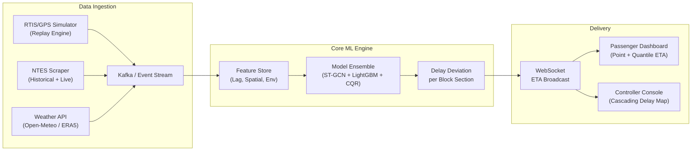
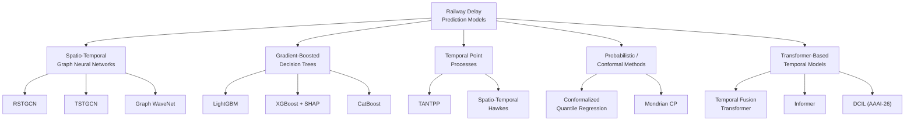
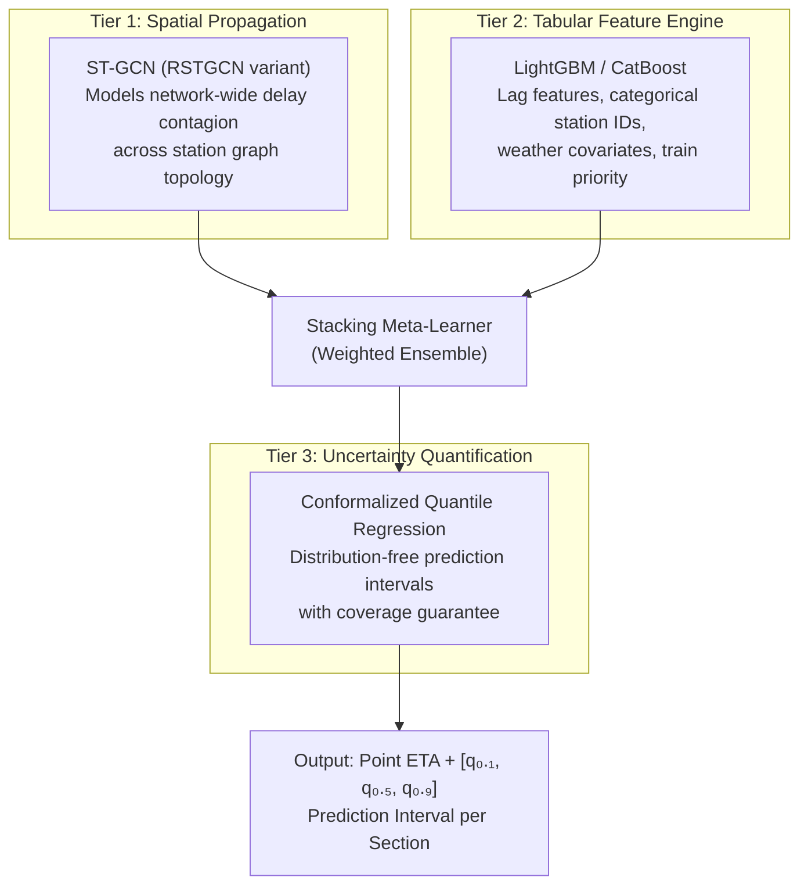
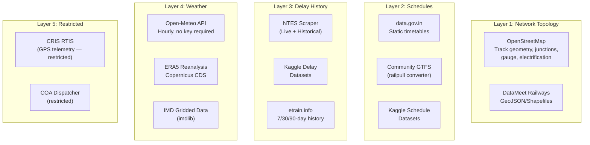
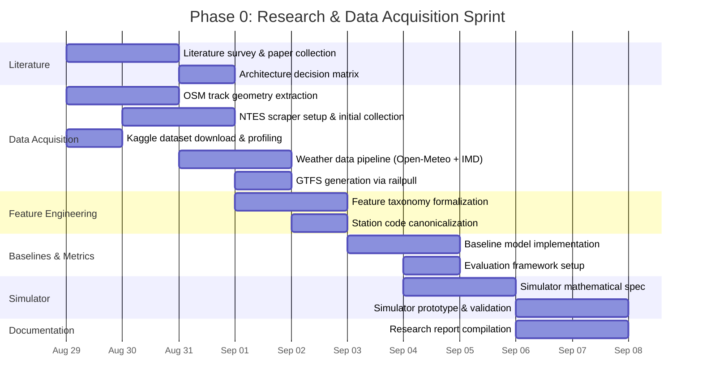

# Phase 0 Research Plan — Dynamic Forecast of Expected Time of Arrival (ETA) for Coaching Trains in Indian Railways

> **Smart India Hackathon (SIH) — Research & Data Acquisition Phase**
> **Document Classification:** Internal Research Artifact — Publication-Grade
> **Date:** 2026-08-28
> **Authors:** SIH Team — ITS & Spatio-Temporal ML Research Unit

---

## Table of Contents

1. [Executive Summary](#1-executive-summary)
2. [Academic Literature & Algorithmic Paradigms](#2-academic-literature--algorithmic-paradigms)
3. [Exhaustive Data Discovery & Acquisition Strategy](#3-exhaustive-data-discovery--acquisition-strategy)
4. [Feature Engineering Research Matrix](#4-feature-engineering-research-matrix)
5. [Evaluation Metrics & Baseline Formulation](#5-evaluation-metrics--baseline-formulation)
6. [Synthetic Telemetry Simulation Formulation](#6-synthetic-telemetry-simulation-formulation)
7. [Phase 0 Execution Timeline (10-Day Sprint)](#7-phase-0-execution-timeline-10-day-sprint)
8. [References](#8-references)

---

## 1. Executive Summary

Indian Railways operates one of the world's largest and most congested rail networks — **68,000+ route-km, 7,300+ stations, ~13,000 passenger trains daily** — across 17 operational zones. Current ETA estimation relies on:

- Static Public Timetable (PTT) with built-in "recovery margin" padding
- Reactive last-reported-station delay extrapolation via NTES
- Manual dispatcher judgement at divisional control rooms

This research plan formulates a **machine-learning-driven dynamic ETA forecasting engine** that predicts *delay deviation per block section* (not absolute timestamps), continuously updated via streaming telemetry, and delivers probabilistic arrival windows (quantile intervals) to passengers and controllers.

> [!IMPORTANT]
> **Scope Boundary:** This document is strictly Phase 0 — research, data discovery, and formulation only. No backend/UI implementation code is produced.

### System Architecture Overview (Target State)



---

## 2. Academic Literature & Algorithmic Paradigms

### 2.1 Taxonomy of State-of-the-Art Architectures

We identify **five primary algorithmic families** and evaluate their suitability for the Indian Railways ETA problem:



---

### 2.2 Spatio-Temporal Graph Neural Networks (STGNNs)

Railway networks possess fixed physical topologies (stations as nodes, track sections as edges) with dynamic operational dependencies. STGNNs jointly capture spatial inter-station topology and time-varying delay propagation.

#### 2.2.1 RSTGCN — Railway-Centric ST-GCN (Indian Railways)

| Attribute | Detail |
|:--|:--|
| **Paper** | *RSTGCN: Railway-Centric Spatio-Temporal Graph Convolutional Network for Train Delay Prediction* |
| **Authors** | Chowdhury, Koley, Chakraborty, Ghosh (IIT Kharagpur / IIT Delhi) |
| **Year / Venue** | 2025–2026 · IEEE Trans. ITS / arXiv:2510.01262 |
| **Dataset** | **4,735 stations across all 17 zones of Indian Railways** |
| **Key Innovation** | Train Frequency-Aware Spatial Attention integrated with Chebyshev polynomial graph convolutions ($K$-order localized filters); Gated Temporal Convolutions (GLUs) for multi-horizon forecasting ($1\text{h}, 2\text{h}, 3\text{h}$) |
| **Performance** | **13–15% relative MAE reduction** over STGCN, DCRNN, Graph WaveNet baselines; stable in high-congestion Northern/North Central Railway zones |

> [!NOTE]
> **Direct Applicability:** RSTGCN is the most directly relevant prior work — it operates on the same Indian Railway Network topology we target. Its station-level aggregation approach can be extended to train-level per-section delay deviation.

#### 2.2.2 TSTGCN — High-Speed Rail Cumulative Delay

| Attribute | Detail |
|:--|:--|
| **Paper** | *Train Time Delay Prediction for High-Speed Train Dispatching Based on Spatio-Temporal Graph Convolutional Network* |
| **Authors** | Zhang, Chen, Liu, Calvi |
| **Year / Venue** | 2022 · IEEE Trans. ITS, Vol. 23(3), pp. 2434–2444 |
| **Key Innovation** | Temporal decomposition into recent/daily/weekly periodic components; spatio-temporal attention mechanism over track-distance-weighted adjacency $\mathbf{A} \in \mathbb{R}^{N \times N}$ |
| **Performance** | **MAE ↓14.2%, RMSE ↓16.8%** vs. STGCN/DCRNN/LSTM baselines |

#### 2.2.3 Graph WaveNet — Adaptive Adjacency Learning

| Attribute | Detail |
|:--|:--|
| **Paper** | *Adaptive Spatio-Temporal Graph Neural Networks for Dynamic Rail Network Delay Propagation* |
| **Year / Venue** | 2024–2026 · Transportation Research Part C |
| **Key Innovation** | Learned adaptive adjacency matrices $\mathbf{E}_1 \mathbf{E}_2^T$ (end-to-end, no static topology required); stacked dilated 1D causal temporal convolutions for exponentially large receptive fields |
| **Performance** | **MAE = 2.18 min, RMSE = 3.92 min** on large European corridors; **3.8× training speedup** over recurrent DCRNN |

---

### 2.3 Gradient-Boosted Decision Trees (GBDT) with Lag Features

GBDTs remain the **industry gold standard** for tabular, feature-engineered delay prediction due to speed, interpretability, and robust handling of mixed numerical/categorical attributes.

#### 2.3.1 LightGBM for Short-Term Freight Arrival

| Attribute | Detail |
|:--|:--|
| **Paper** | *Short-Term Arrival Delay Time Prediction in Freight Rail Operations Using Data-Driven Models* |
| **Authors** | Pineda-Jaramillo, Bigi, Bosi, Viti, D'Ariano |
| **Year / Venue** | 2023 · IEEE Access, Vol. 11, pp. 46966–46978 |
| **Key Innovation** | Systematic lag engineering: departure delay at previous $k$ stations, rolling dwell-time statistics, cumulative run-time variance, train composition vectors |
| **Performance** | **LightGBM MAE: 2.1–3.4 min** ($R^2 > 0.82$); **5–8× faster** than XGBoost; departure delay at origin + $t-1$ lag contributed >65% predictive power |

#### 2.3.2 XGBoost with Dispatching Commands

| Attribute | Detail |
|:--|:--|
| **Paper** | *Data-driven train delay prediction incorporating dispatching commands: An XGBoost-metaheuristic framework* |
| **Authors** | Gao, Chen, Xu |
| **Year / Venue** | 2024 · IET Intelligent Transport Systems, Vol. 18(10), pp. 1777–1796 |
| **Key Innovation** | Integrates real-time dispatching intervention commands (holding, overtaking orders) as features; PSO/GA hyperparameter tuning; SHAP explainability |
| **Performance** | **>20% MAE reduction, ~18% RMSE improvement** over regression baselines |

#### 2.3.3 CatBoost for High-Cardinality Categorical Logs

| Attribute | Detail |
|:--|:--|
| **Year / Venue** | 2023–2025 · J. Rail Transport Planning & Management |
| **Key Innovation** | PACF-based lag pruning ($t-1, t-2, t-5$); Ordered Target Statistics for >1,000 unique station/train IDs |
| **Performance** | **MAE: 1.85 min, RMSE: 3.12 min**; resilient against target leakage |

---

### 2.4 Temporal Point Processes & Event-Driven Models

Train operations are fundamentally **continuous-time asynchronous point events** (arrival, departure, track clearance). TPPs model these dynamics without discretizing time into fixed bins.

#### 2.4.1 TANTPP — Train Arrival Neural Temporal Point Process

| Attribute | Detail |
|:--|:--|
| **Paper** | *A Multi-Source Dynamic Temporal Point Process Model for Train Delay Prediction* |
| **Authors** | Zhang, Du, Peng, Liu, Mohammed, Calvi |
| **Year / Venue** | 2024 · IEEE Trans. ITS, Vol. 25(11), pp. 16580–16592 |
| **Formulation** | Treats arrivals as asynchronous sequence $S = \{(t_1, m_1), \dots, (t_k, m_k)\}$; Multi-Source Dynamic Spatio-Temporal Embedding encoder; **Log-Normal Mixture** intensity approximation |
| **Performance** | **MAE ↓14.8%, RMSE ↓12.3%, MAPE ↓11.2%** vs. RMTPP, Neural Hawkes, LSTM, STGCN |

#### 2.4.2 Non-Stationary Spatio-Temporal Hawkes Process

| Attribute | Detail |
|:--|:--|
| **Year / Venue** | 2025–2026 · Transportation Research Part C |
| **Formulation** | Conditional intensity: $\lambda(t) = \mu(t) + \sum_{t_i < t} \alpha_{ij} \kappa(t - t_i, d_{ij})$ with self-attention-augmented triggering matrices $\alpha_{ij}$ |
| **Performance** | **>25% log-likelihood improvement** over stationary Hawkes; **91.4% precision** in root-cause primary delay identification |

---

### 2.5 Probabilistic Methods: Quantile Regression & Conformal Prediction

#### 2.5.1 Conformalized Quantile Regression (CQR) for Railways

| Attribute | Detail |
|:--|:--|
| **Paper** | *Reliable Train Delay Forecasting with Conformal Prediction* |
| **Authors** | Feng, Nguyen, Luo |
| **Year / Venue** | 2026 · Springer Nature |
| **Key Innovation** | Split Conformal + Mondrian (stratified) CP over tree-based ML; **distribution-free, finite-sample coverage guarantee**: $\mathbb{P}(Y_{n+1} \in \hat{C}(X_{n+1})) \ge 1 - \alpha$ |
| **Dataset** | **12.8M+ UK National Rail records** |
| **Performance** | Empirical coverage ≥90.1% at nominal 90%; mean interval width **≤4.2 minutes** |

#### 2.5.2 UncertBAT — Adaptive Conformalized Quantile Regression

| Attribute | Detail |
|:--|:--|
| **Year / Venue** | 2024–2025 · Transportation Research Part C |
| **Key Innovation** | CQR with adaptive grouping calibration for heteroscedastic transit travel times; optimizes PICP and PINAW jointly |
| **Performance** | Exact 90%/95% coverage; **22.4% narrower intervals** than QRF/GPR |

---

### 2.6 Transformer-Based Temporal Models

#### 2.6.1 DCIL — Drift-Corrected Imitation Learning (AAAI-26)

| Attribute | Detail |
|:--|:--|
| **Paper** | *Simulation-Driven Railway Delay Prediction: An Imitation Learning Approach* |
| **Authors** | Elliker, Read, Vanier, Bifet |
| **Year / Venue** | 2026 · AAAI-26 / arXiv:2512.19737 |
| **Key Innovation** | Reframes delay forecasting as **sequential closed-loop simulation**; Drift-Corrected Imitation Learning (extending DAgger) to correct compounding covariate shift during multi-hop rollouts |
| **Performance** | Stable MAE (2.4–3.8 min) over **10+ consecutive downstream hops** where autoregressive models diverge |

#### 2.6.2 Temporal Fusion Transformer (TFT)

| Attribute | Detail |
|:--|:--|
| **Year / Venue** | 2024 · Transportation Research Part C |
| **Key Innovation** | Three-stream input architecture (static metadata + known future inputs + observed historical); Variable Selection Networks (VSNs) for dynamic feature gating; interpretable attention heatmaps |
| **Performance** | **16.4% multi-horizon MAE improvement, 19.1% lower CRPS** vs. LSTM/Seq2Seq |

#### 2.6.3 Informer with ProbSparse Attention

| Attribute | Detail |
|:--|:--|
| **Year / Venue** | 2023–2024 · Applied Soft Computing / IEEE Access |
| **Key Innovation** | ProbSparse Self-Attention reduces $\mathcal{O}(L^2) \to \mathcal{O}(L \log L)$; self-attention distilling cascades for multi-station long-sequence forecasting |
| **Performance** | **35% GPU memory reduction, 40% faster inference**; MSE ↓14.7% over 24–48 step horizons |

---

### 2.7 Cascading Delays & Mixed-Traffic Corridor Propagation

Shared corridors carrying heterogeneous traffic (Rajdhani/Vande Bharat vs. Mail/Express vs. Freight) experience severe **knock-on delay cascades** due to track-speed differentials and priority rules.

**Key findings from literature (2021–2025):**

1. **Non-Linear Transition at 75% Capacity Utilization:** When corridor capacity utilization exceeds ~75%, knock-on delay propagation transitions from **additive to exponential** growth (*J. Rail Transport Planning & Management*, 2023–2025).

2. **Microscopic Simulation + ML Surrogates:** Simulators (OpenTrack, RailSys) generate synthetic perturbation scenarios to train surrogate GNN/CatBoost models. When passenger trains run late, freight trains are held at loops, creating secondary freight backlog that eventually blocks subsequent passenger paths.

3. **Dynamic Conflict Detection & Resolution (CD&R):** MILP formulations with ML-predicted dynamic delay margins solve overtake/crossing conflicts in real time. ML-driven overtaking probability models reduce secondary freight delay prediction error by **~28%**.

4. **Indian Railways Specifics:**
   - Single-track bottlenecks on ~40% of IR routes create cascading crossing delays
   - Rake-sharing turnaround times propagate origin delays from one service to the next
   - Winter fog on Indo-Gangetic Plain triggers blanket speed restrictions (max 30 km/h when visibility < 200m), affecting entire divisional corridors simultaneously

### 2.8 Indian Railways-Specific Research

| Study | Method | Dataset | Key Result |
|:--|:--|:--|:--|
| **RSTGCN** (IIT KGP/Delhi, 2025) | Train-frequency-aware ST-GCN | 4,735 IR stations, 17 zones | 13–15% MAE reduction network-wide |
| **Arshad & Ahmed (2021–2024)** | RF/XGBoost/CatBoost + weather | Indo-Gangetic Plain corridor (NTES + IMD) | **>91.5% accuracy** for delay severity classification; **MAE ~6.8 min** during severe fog |
| **IFLDP (2023–2025)** | Fuzzy Logic + BiLSTM | NTES telemetry logs | **18.2% RMSE reduction** vs. static schedule extrapolation |

---

### 2.9 Recommended Architecture: Hybrid Ensemble

Based on the literature survey, we recommend a **three-tier hybrid architecture**:



> [!TIP]
> **Rationale:** ST-GCN captures topological delay propagation that tree models cannot; LightGBM/CatBoost handles tabular operational features with speed and interpretability; CQR wraps the ensemble output with statistically guaranteed prediction intervals. This mirrors the strongest results from independent papers while avoiding single-architecture blind spots.

---

## 3. Exhaustive Data Discovery & Acquisition Strategy

### 3.1 Data Source Taxonomy



---

### 3.2 Network Topology & Track Geometry

#### 3.2.1 OpenStreetMap (Geofabrik + Overpass API)

| Parameter | Value |
|:--|:--|
| **Source URL** | [download.geofabrik.de/asia/india.html](http://download.geofabrik.de/asia/india.html) |
| **Format** | `.osm.pbf` (~1.5 GB), extractable to GeoJSON |
| **Coverage** | Near-complete Indian rail network |
| **Update** | Real-time (crowdsourced) |
| **Extraction Tools** | `osmium-tool`, `pyrosm`, `osmnx` |

**Critical OSM Tags for Feature Engineering:**

| Tag | Values | Use Case |
|:--|:--|:--|
| `railway` | `rail`, `station`, `halt`, `junction`, `signal` | Node/edge classification |
| `gauge` | `1676` (BG), `1000` (MG), `762` (NG) | Gauge-specific speed models |
| `tracks` | `1`, `2`, `4` | Single/double/quadruple — congestion modeling |
| `electrified` | `contact_line` / `no` | Traction type and speed capability |
| `maxspeed` | `110`, `130`, `160` | Section speed limit |
| `railway:traffic_mode` | `passenger`, `freight`, `mixed` | Traffic mix classification |

**Overpass QL Query (India-wide rail network):**
```
[out:json][timeout:180];
area["name"="India"]["admin_level"="2"]->.searchArea;
(
  way["railway"="rail"](area.searchArea);
  node["railway"="station"](area.searchArea);
  node["railway"="halt"](area.searchArea);
  node["railway"="junction"](area.searchArea);
  node["railway"="signal"](area.searchArea);
);
out body; >; out skel qt;
```

> [!WARNING]
> Full-India Overpass queries may timeout. Use Geofabrik `.osm.pbf` bulk download and filter locally with `osmium tags-filter india-latest.osm.pbf w/railway=rail n/railway=station -o india_rail.osm.pbf`.

#### 3.2.2 DataMeet Railways Repository

| Parameter | Value |
|:--|:--|
| **Source URL** | [github.com/datameet/railways](https://github.com/datameet/railways) |
| **Format** | GeoJSON, Shapefiles, CSV |
| **Content** | Spatial network of IR tracks, stations, zones, division boundaries |
| **Limitation** | Last major update ~2016–2018; requires sync with current network |

---

### 3.3 Timetable & Schedule Data

| Source | URL | Format | Coverage | Limitation |
|:--|:--|:--|:--|:--|
| **data.gov.in Timetable** | [data.gov.in](https://data.gov.in/) | CSV, XML, JSON | Static snapshots (2014–2017 baseline) | No delay data; train numbers may have changed |
| **data.gov.in Station Codes** | [data.gov.in](https://data.gov.in/) | CSV | ~8,000+ stations with lat/lon | Minor spatial inaccuracies for small halts |
| **Kaggle — Anmol Kumar Schedule** | [kaggle.com](https://www.kaggle.com/datasets/anmolkumar/indian-railways-schedule-prices-availability-data) | CSV | Historical snapshot | Static only; no running timestamps |
| **Kaggle — Arihant Jain Latest** | [kaggle.com](https://www.kaggle.com/datasets/arihantjain/indian-railways-latest) | CSV, SQLite | 11,000+ train routes (2020–2023) | Schedule-only |
| **GTFS via `railpull`** | [github.com/shwetankg07/railpull](https://github.com/shwetankg07/railpull) | GTFS `stops.txt`, `routes.txt`, `stop_times.txt`, `calendar.txt` | Generated from live NTES | Static GTFS only; no GTFS-RT |

---

### 3.4 Historical Delay Data

| Source | URL | Format | Coverage | Key Features | Limitation |
|:--|:--|:--|:--|:--|:--|
| **Kaggle — IR Delays 2025** (Aditi Raghavan) | [kaggle.com](https://www.kaggle.com/datasets/aditiraghavan/indian-railways-train-delays-dataset-2025) | CSV | 2024–2025 | Station-wise delay minutes, severity classification | Aggregated intervals, not continuous time series |
| **Kaggle — IR Delay Dataset** (Antareep Dey) | [kaggle.com](https://www.kaggle.com/datasets/antareepdey/indian-railway-delay-dataset) | CSV, Parquet | 2018–2022 | Inter-city express delays on Golden Quadrilateral | Omits local/EMU/freight |
| **Kaggle — Predict Train Delay** (Competition) | [kaggle.com](https://www.kaggle.com/competitions/133990) | CSV | Multi-month sample | Binary punctuality (>15 min threshold) | Anonymized feature set |
| **NTES Scraper** (Primary Collection) | `enquiry.indianrail.gov.in/mntes/` | JSON (scraped) | Real-time + archival | Station-by-station actual vs. scheduled | No official API; anti-bot measures |
| **etrain.info** | [etrain.info](https://etrain.info/) | HTML (scraped) | Last 7/30/90 days | Per-train delay history, punctuality % | Cloudflare WAF, CAPTCHAs |

**NTES Scraping Endpoints:**

| Endpoint | URL Pattern | Returns |
|:--|:--|:--|
| Live Running Status | `GET .../q?opt=trainRunningStatus&trainNo={NO}&date={DD-MMM-YYYY}` | Delay per intermediate station |
| Live Station Board | `GET .../q?opt=liveStation&stationCode={STN}&hours={2\|4\|8}` | All trains ±N hours |
| Train Full Schedule | `GET .../q?opt=trainSchedule&trainNo={NO}` | Complete stop sequence |

**Python Scraper Libraries:** `ntes-client` (PyPI), `pyinrail` (PyPI), custom Playwright headless automation.

> [!CAUTION]
> **NTES Anti-Bot Measures:** Rate limit to ≤1 request/2–3 seconds per IP; rotate user-agents; handle CSRF token rotation; daily maintenance blackout 23:30–00:30 IST. Respect `robots.txt` and terms of service.

---

### 3.5 Weather Data Sources

| Source | URL | Resolution | Coverage | Key Variables | Access |
|:--|:--|:--|:--|:--|:--|
| **Open-Meteo Historical** | [open-meteo.com](https://open-meteo.com/en/docs/historical-weather-api) | **Hourly**, 1940–present | Worldwide incl. India | `visibility`, `precipitation`, `weather_code` (WMO 45/48=fog), `temperature_2m`, `wind_speed_10m` | REST API, **no key required**, 10K calls/day |
| **ERA5 Reanalysis** | [cds.climate.copernicus.eu](https://cds.climate.copernicus.eu/) | 0.25° (~31 km), hourly | Global, 1940–present | `total_precipitation`, `2m_temperature`, `2m_dewpoint_temperature`, `10m_wind`, `boundary_layer_height` | Python `cdsapi`, free registration |
| **IMD Gridded** | [data.imd.gov.in](https://data.imd.gov.in/) | 0.25° (rain), 0.5° (temp), daily | India, 1901–present | Rainfall (daily), Max/Min temperature | Python `imdlib` (`pip install imdlib`) |

**Open-Meteo Example Query (Delhi, Jan 2024):**
```http
GET https://archive-api.open-meteo.com/v1/archive
  ?latitude=28.6139&longitude=77.2090
  &start_date=2024-01-01&end_date=2024-01-15
  &hourly=temperature_2m,precipitation,visibility,weather_code,wind_speed_10m
  &timezone=Asia/Kolkata
```

> [!TIP]
> **Recommended Primary Source:** Open-Meteo for operational features (hourly visibility is critical for fog-based speed restrictions) + IMD gridded rainfall for seasonal/monsoon analysis. ERA5 for comprehensive reanalysis validation.

---

### 3.6 CRIS Data Systems — Public vs. Restricted

```
┌─────────────────────────────────────────────────────────────────────┐
│                    CRIS Railway Information Systems                  │
├────────────────────────────┬────────────────────────────────────────┤
│    PUBLICLY ACCESSIBLE     │       RESTRICTED / B2B ONLY           │
├────────────────────────────┤────────────────────────────────────────┤
│ • NTES Web/App Queries     │ • RTIS Raw GPS Stream (30-sec pings)  │
│ • Spot Your Train Status   │ • COA Dispatcher Graphs               │
│ • Live Station Schedule    │ • ICMS Punctuality Backend            │
│ • Aggregate Annual Stats   │ • FOIS Freight Logistics              │
│                            │ • Pravah Enterprise API (gated B2B)   │
└────────────────────────────┴────────────────────────────────────────┘
```

> [!IMPORTANT]
> **RTIS GPS telemetry** (30-second locomotive position updates via NavIC/ISRO satellite) is the gold-standard data source but is completely restricted to internal CRIS servers. This is why we need a **Replay Simulator** (Section 6) to generate synthetic telemetry for development.

---

### 3.7 Data Cleaning & Normalization Strategy

#### 3.7.1 Missing GPS Pings

| Issue | Strategy |
|:--|:--|
| **Intermittent GPS dropout** (tunnels, dense urban canyons) | Linear interpolation of position between last-known and next-known fixes; flag interpolated segments with confidence score |
| **Complete blackout > 10 min** | Mark segment as "unobserved"; fall back to section-level average velocity from historical data |
| **Clock skew / timestamp jitter** | NTP-synchronized server-side timestamps; reject pings with >30s timestamp deviation |

#### 3.7.2 Inconsistent Station Codes

| Issue | Strategy |
|:--|:--|
| **Multiple codes for same station** (e.g., `NDLS` vs `DEL` vs `DLI` for Delhi complex) | Build canonical station code mapping table from NTES master station list; fuzzy-match on station name + lat/lon proximity (<500m) |
| **Renamed / merged stations** | Maintain temporal code mapping with effective dates |
| **Missing lat/lon for small halts** | Geocode from OSM `railway=halt` nodes; manual verification for unmatched |

#### 3.7.3 Multi-Day Train Schedules

| Issue | Strategy |
|:--|:--|
| **Trains spanning midnight** (e.g., Rajdhani departing Day 1, arriving Day 3) | Use **trip-day indexing**: `(train_no, origin_date)` as composite key; all timestamps stored as offset-minutes from trip origin departure |
| **Day-of-week operating patterns** | Boolean day-mask `[Mon, Tue, ..., Sun]` per train; handle exceptions (holidays, special runs) via `calendar_dates.txt` GTFS pattern |
| **Rake-sharing / linked services** | Track rake links: if Train A's rake becomes Train B, propagate origin delay |

---

## 4. Feature Engineering Research Matrix

### 4.1 Complete Feature Taxonomy

Features are organized into four categories with formal definitions. Let:
- $s_k$ = station $k$ along the route ($k = 1, \dots, K$)
- $b_k$ = block section between $s_k$ and $s_{k+1}$
- $\tau_k^{\text{sched}}$ = scheduled arrival at $s_k$
- $\tau_k^{\text{actual}}$ = actual arrival at $s_k$
- $d_k = \tau_k^{\text{actual}} - \tau_k^{\text{sched}}$ = delay at station $k$

---

### 4.2 Category A: Spatial / Topological Features

| Feature | Symbol | Definition / Computation | Source | Rationale |
|:--|:--|:--|:--|:--|
| **Track capacity (single/double/quad)** | $C_{b_k} \in \{1, 2, 4\}$ | Number of parallel tracks in block section $b_k$ | OSM `tracks=*` tag | Single-track sections create crossing delays; capacity directly limits throughput |
| **Section distance** | $D_{b_k}$ (km) | Track-distance between $s_k$ and $s_{k+1}$ | OSM way length / GTFS `shape_dist_traveled` | Longer sections amplify speed-variation impact on delay |
| **Junction degree** | $\text{deg}(s_k)$ | Number of converging/diverging track edges at station $s_k$ | OSM graph node degree | Higher-degree junctions = more conflict potential |
| **Electrification status** | $E_{b_k} \in \{0, 1\}$ | Whether section has overhead electrification | OSM `electrified=contact_line` | Electrified sections support higher speeds; diesel sections have lower MPS |
| **Section max permitted speed** | $v_{b_k}^{\max}$ (km/h) | Maximum permissible speed on section $b_k$ | OSM `maxspeed=*` | Constrains theoretical minimum section traversal time |
| **Gauge type** | $G_{b_k} \in \{\text{BG}, \text{MG}, \text{NG}\}$ | Track gauge (1676mm / 1000mm / 762mm) | OSM `gauge=*` | Non-BG sections have severe speed restrictions |
| **Elevation gradient** | $\nabla h_{b_k}$ (m/km) | Average gradient of section from SRTM/ASTER DEM | SRTM 30m DEM | Uphill gradients reduce speed; Ghats/mountain sections have permanent restrictions |
| **Loop line availability** | $L_{s_k} \in \{0, 1, 2, \dots\}$ | Number of loop/siding lines at station $s_k$ | OSM `railway=siding` | Loop availability determines crossing/overtaking feasibility |
| **Zone / Division** | $Z_{s_k}$, $\text{Div}_{s_k}$ | Railway zone and division of station $s_k$ | IR Master Data | Zone-specific operational policies and punctuality culture |

---

### 4.3 Category B: Temporal / Operational Features

| Feature | Symbol | Definition / Computation | Source | Rationale |
|:--|:--|:--|:--|:--|
| **Train priority rank** | $P_i \in \{1, \dots, 6\}$ | Priority hierarchy of train $i$ | IR classification | Higher priority trains get precedence at crossings |
| **Scheduled headway** | $H_{b_k}^{\text{sched}}$ (min) | Scheduled time gap between consecutive trains on section $b_k$ | Timetable | Low headway = high congestion risk |
| **Time-of-day** | $\text{ToD}_k = (\sin\frac{2\pi h}{24}, \cos\frac{2\pi h}{24})$ | Cyclical encoding of hour $h$ of scheduled arrival | Timetable | Peak hours (06–10, 16–20) have higher congestion |
| **Day-of-week** | $\text{DoW}_k = (\sin\frac{2\pi w}{7}, \cos\frac{2\pi w}{7})$ | Cyclical encoding of weekday $w$ | Calendar | Weekend/holiday traffic patterns differ |
| **Scheduled dwell time** | $\Delta\tau_k^{\text{dwell,sched}}$ (min) | Scheduled stop duration at station $s_k$ | Timetable | Longer dwells provide recovery margin |
| **Timetable recovery slack** | $\sigma_k^{\text{slack}}$ (min) | Built-in buffer time: $\sigma_k = (\tau_k^{\text{sched}} - \tau_{k-1}^{\text{sched}}) - T_{b_{k-1}}^{\text{min}}$ | Timetable + section MRT | Available margin to absorb upstream delays |
| **Cumulative trip progress** | $\rho_k = \frac{\sum_{j=1}^{k} D_{b_j}}{\sum_{j=1}^{K} D_{b_j}}$ | Fraction of total route distance completed | Timetable distances | Delay behavior changes along route |
| **Is originating station** | $\mathbb{I}(k = 1)$ | Binary: whether this is the train's first stop | Timetable | Originating delays propagate differently |
| **Special day indicator** | $\text{Holiday}_k \in \{0, 1\}$ | National holiday, festival, exam season | Calendar | Extreme passenger loads cause extended dwell |

**Train Priority Hierarchy (Indian Railways):**

| Rank ($P_i$) | Category | Examples | Precedence Behavior |
|:--|:--|:--|:--|
| 1 | Vande Bharat / Gatimaan | Train 18s, Gatimaan Express | Highest priority; rarely held |
| 2 | Rajdhani / Shatabdi / Tejas | Rajdhani Express, Shatabdi Express | Near-highest; minimal intermediate stops |
| 3 | Duronto / Humsafar | Duronto Express, Humsafar Express | High priority; limited stops |
| 4 | Mail / Superfast Express | All Mail/Express with SF surcharge | Standard priority; may be held for Rank 1–3 |
| 5 | Passenger / MEMU / DEMU | Local stopping trains | Frequently held at loops for overtaking |
| 6 | Freight | Goods, Parcel, Military Special | Lowest priority; extensively re-routed and held |

---

### 4.4 Category C: Dynamic Telemetry Features

| Feature | Symbol | Definition / Computation | Source | Rationale |
|:--|:--|:--|:--|:--|
| **Current delay** | $d_k$ (min) | $\tau_k^{\text{actual}} - \tau_k^{\text{sched}}$ at last reported station | NTES / Simulator | Most powerful single predictor (persistence baseline) |
| **Delay delta (acceleration)** | $\Delta d_k = d_k - d_{k-1}$ (min) | Change in delay between consecutive stations | Computed | Positive = worsening; negative = recovering |
| **Rolling delay trend** | $\bar{\Delta d}_k^{(w)} = \frac{1}{w}\sum_{j=k-w+1}^{k} \Delta d_j$ | Moving average of delay changes over window $w$ | Computed | Smooths noise; captures sustained recovery or degradation |
| **Section running time deviation** | $\delta T_{b_k} = T_{b_k}^{\text{actual}} - T_{b_k}^{\text{sched}}$ | Actual vs. scheduled section traversal time | Computed | Captures section-specific slowdowns (PSR, congestion) |
| **Instantaneous velocity** | $v_k^{\text{inst}}$ (km/h) | GPS-derived speed at last ping | RTIS / Simulator | Sub-MPS velocity indicates restriction or congestion |
| **Velocity ratio** | $r_k^v = \frac{v_k^{\text{inst}}}{v_{b_k}^{\max}}$ | Fraction of maximum permitted speed | Computed | Low ratio signals operational constraint |
| **Dwell time anomaly** | $\epsilon_k^{\text{dwell}} = \Delta\tau_k^{\text{dwell,actual}} - \Delta\tau_k^{\text{dwell,sched}}$ | Excess dwell time at station $s_k$ | NTES / Simulator | Excessive dwell = crew change, watering, platform congestion |
| **Preceding train headway** | $H_k^{\text{actual}}$ (min) | Time since preceding train cleared section $b_k$ | NTES (section entry logs) | Short actual headway = bunching; long = clear track |
| **Upstream train delay** | $d_k^{\text{upstream}}$ (min) | Delay of the train immediately ahead on same route | NTES | Preceding train's delay propagates via block occupation |
| **Block section occupancy count** | $N_{b_k}^{\text{occ}}$ | Number of trains currently in surrounding sections | NTES | High occupancy = network congestion |
| **Historical section delay (same ToD, DoW)** | $\tilde{d}_{b_k}^{\text{hist}}$ (min) | Median historical delay for this section, same weekday, same time window | Historical DB | Strong seasonal/periodic prior |
| **Lag features** | $d_{k-1}, d_{k-2}, d_{k-5}$ | Delay at previous $1, 2, 5$ stations | Computed | PACF-validated significant autocorrelation lags |

---

### 4.5 Category D: Environmental Features

| Feature | Symbol | Definition / Computation | Source | Rationale |
|:--|:--|:--|:--|:--|
| **Visibility** | $V_k$ (meters) | Horizontal visibility at station $s_k$ | Open-Meteo hourly | **Critical:** Dense fog (V < 200m) triggers blanket 30 km/h speed cap on IR |
| **Precipitation rate** | $\text{Precip}_k$ (mm/h) | Rainfall/snowfall intensity | Open-Meteo / ERA5 | Heavy rain → waterlogging, track flooding, signal failure |
| **WMO Weather Code** | $\text{WX}_k \in \{0, \dots, 99\}$ | Standardized weather classification | Open-Meteo | Codes 45/48 = fog, 51–67 = drizzle/rain, 95–99 = thunderstorm |
| **Temperature** | $T_k$ (°C) | 2-meter air temperature | Open-Meteo / ERA5 | Extreme heat (>45°C): rail buckling risk → speed restrictions |
| **Fog severity index** | $\text{FSI}_k$ | Composite: $\text{FSI} = f(V_k, T_k - T_k^{\text{dew}}, \text{RH}_k)$ | Computed from ERA5/Open-Meteo | Captures fog formation propensity beyond simple visibility |
| **Wind speed** | $W_k$ (km/h) | 10-meter wind speed | Open-Meteo / ERA5 | High crosswinds (>60 km/h) trigger restrictions on elevated sections |
| **Seasonal regime** | $\text{Season}_k \in \{\text{Fog, Monsoon, Summer, Normal}\}$ | Categorical based on month + region | Calendar + geography | Different delay mechanisms dominate in each regime |
| **Track temperature proxy** | $T_k^{\text{rail}} \approx T_k + \Delta T_{\text{solar}}$ | Estimated rail temperature (ambient + solar gain) | ERA5 + radiation data | Steel rail expansion limit at ~65°C → speed restriction trigger |

**Fog Speed Restriction Model (Indian Railways):**

| Visibility Range | Maximum Permitted Speed | IR Operational Rule |
|:--|:--|:--|
| V > 1000m | Normal MPS | No restriction |
| 500m < V ≤ 1000m | 75 km/h | Caution regime |
| 200m < V ≤ 500m | 60 km/h | Fog Warning |
| 100m < V ≤ 200m | 30 km/h | Dense Fog (signal sighting distance) |
| V ≤ 100m | 15 km/h | Very Dense Fog (extreme caution) |

---

## 5. Evaluation Metrics & Baseline Formulation

### 5.1 Point-Forecast Metrics

#### 5.1.1 Mean Absolute Error (MAE)

$$\text{MAE} = \frac{1}{n} \sum_{i=1}^{n} |y_i - \hat{y}_i|$$

- **Units:** Minutes
- **Interpretation:** Average magnitude of prediction error
- **Properties:** Linear penalty, robust to outliers, interpretable

#### 5.1.2 Root Mean Squared Error (RMSE)

$$\text{RMSE} = \sqrt{\frac{1}{n} \sum_{i=1}^{n} (y_i - \hat{y}_i)^2}$$

- **Units:** Minutes
- **Properties:** Quadratic penalty — heavily penalizes large errors (catastrophic under-predictions that cause missed connections)

#### 5.1.3 Mean Absolute Percentage Error (MAPE) — Travel Time Variant

$$\text{MAPE} = \frac{100\%}{n} \sum_{i=1}^{n} \left| \frac{T_i^{\text{actual}} - T_i^{\text{predicted}}}{T_i^{\text{actual}}} \right|$$

> [!WARNING]
> **Do NOT apply MAPE to delay duration** $d_i$ — on-time trains have $d_i = 0$, causing division by zero. Apply only to **total section running time** $T_i$.

#### 5.1.4 Mean Error / Bias (ME)

$$\text{ME} = \frac{1}{n} \sum_{i=1}^{n} (\hat{y}_i - y_i)$$

- **Positive ME** = systematic over-prediction (pessimistic ETA)
- **Negative ME** = systematic under-prediction (optimistic ETA — worse for passengers)

---

### 5.2 Threshold Accuracy Metrics

#### 5.2.1 Sectional Arrival Accuracy within ±τ minutes

$$\text{Acc}_\tau = \frac{1}{n} \sum_{i=1}^{n} \mathbb{I}(|y_i - \hat{y}_i| \le \tau) \times 100\%$$

**Standard thresholds for reporting:**

| Threshold $\tau$ | Context |
|:--|:--|
| ±2 min | Metro / high-precision benchmark |
| **±5 min** | **Primary SIH target for coaching trains** |
| ±10 min | Standard long-distance tolerance |
| ±15 min | IR official "on-time" definition |
| ±30 min | Severe disruption horizon |

#### 5.2.2 Horizon-Decomposed MAE

$$\text{MAE}(H) = \frac{1}{|S_H|} \sum_{i \in S_H} |y_i - \hat{y}_i|, \quad S_H = \{i \mid t_{\text{target}} - t_{\text{predict}} \in [H - \Delta h, H]\}$$

Standard look-ahead horizons: $H \in \{15, 30, 60, 120, 240\}$ minutes.

#### 5.2.3 Station-Hop Decomposed MAE

$$\text{MAE}(k) = \text{MAE for } k\text{-th station ahead from current position}$$

Report at $k = 1$ (next station), $k = 3, 5, 10$, and $k = K$ (terminal).

---

### 5.3 Probabilistic Forecast Metrics

#### 5.3.1 Continuous Ranked Probability Score (CRPS)

$$\text{CRPS}(F, y) = \int_{-\infty}^{\infty} \left( F(x) - \mathbf{1}(x \ge y) \right)^2 dx$$

**Equivalent energy form:**
$$\text{CRPS}(F, y) = \mathbb{E}_F[|X - y|] - \frac{1}{2}\mathbb{E}_F[|X - X'|], \quad X, X' \overset{i.i.d.}{\sim} F$$

**Gaussian closed-form** (when model outputs $\hat{\mu}, \hat{\sigma}$):
$$\text{CRPS}(\mathcal{N}(\mu, \sigma^2), y) = \sigma \left[ z(2\Phi(z) - 1) + 2\phi(z) - \frac{1}{\sqrt{\pi}} \right], \quad z = \frac{y - \mu}{\sigma}$$

> [!NOTE]
> **Key property:** If the distribution collapses to a point prediction $\delta_{\hat{y}}$, then $\text{CRPS} \equiv |y - \hat{y}| = \text{AE}$. Thus CRPS generalizes MAE to full distributions.

#### 5.3.2 Quantile Loss / Pinball Loss

$$\mathcal{L}_\alpha(y, \hat{y}_\alpha) = \begin{cases} \alpha(y - \hat{y}_\alpha) & \text{if } y \ge \hat{y}_\alpha \\ (1 - \alpha)(\hat{y}_\alpha - y) & \text{if } y < \hat{y}_\alpha \end{cases}$$

Report for quantiles $\alpha \in \{0.05, 0.10, 0.25, 0.50, 0.75, 0.90, 0.95\}$.

#### 5.3.3 Prediction Interval Coverage & Width

**Coverage (PICP):**
$$\text{PICP} = \frac{1}{n} \sum_{i=1}^{n} \mathbb{I}(l_i \le y_i \le u_i) \times 100\%$$

Target: $\text{PICP} \approx (1-\alpha) \times 100\%$ (e.g., 90% for $[q_{0.05}, q_{0.95}]$).

**Sharpness (MPIW):**
$$\text{MPIW} = \frac{1}{n} \sum_{i=1}^{n} (u_i - l_i)$$

Lower MPIW = sharper, more actionable intervals.

#### 5.3.4 Winkler Score (Interval Score)

$$\text{WS}_\alpha = \begin{cases} (u_i - l_i) & \text{if } l_i \le y_i \le u_i \\ (u_i - l_i) + \frac{2}{\alpha}(l_i - y_i) & \text{if } y_i < l_i \\ (u_i - l_i) + \frac{2}{\alpha}(y_i - u_i) & \text{if } y_i > u_i \end{cases}$$

#### 5.3.5 PIT Calibration Diagnostics

Compute $u_i = F_i(y_i) \in [0, 1]$ for each test instance. Histogram of $\{u_i\}$:
- **Uniform (flat)** → perfectly calibrated
- **U-shaped** → overconfident (intervals too narrow)
- **Bell-shaped** → underconfident (intervals too wide)
- **Skewed** → systematic bias

---

### 5.4 Baseline Models to Beat

| Tier | Model | Formulation | Expected Performance |
|:--|:--|:--|:--|
| **Tier 0** | **Scheduled Timetable (Zero-Delay)** | $\hat{d}_{s_k} = 0 \implies \hat{\tau}_k = \tau_k^{\text{sched}}$ | Worst-case reference; RMSE ~30–60 min on delayed trains |
| **Tier 1** | **Constant Delay Persistence** | $\hat{d}_{s_k} = d_{s_{\text{last}}}$ (delay at last reported station carries forward) | Strong naive baseline; MAE ~5–10 min |
| **Tier 2** | **Constant Velocity Extrapolation** | $\hat{\tau}_k = t_{\text{now}} + \frac{D_{\text{remaining}}}{v_{\text{current}}}$, capped at $v^{\max}$ | Physics-based; fails at stops and speed changes |
| **Tier 3** | **Historical Median Section Time** | $\hat{T}_{b_k} = \text{median}(\{T_{b_k}^{(h)}\}_{h \in \mathcal{H}_{\text{train, dow, tod}}})$ | Captures periodic patterns; MAE ~4–8 min |
| **Tier 4** | **ARIMA(p,d,q)** | $\hat{d}_t = c + \sum_{j=1}^{p}\phi_j d_{t-j} + \sum_{k=1}^{q}\theta_k \epsilon_{t-k}$ | Linear autocorrelation baseline |

> [!IMPORTANT]
> **Success Criterion:** The final ML model must **statistically significantly outperform Tier 1 (Constant Delay Persistence)** across all horizon bands, with particular emphasis on stations 5+ hops ahead where persistence degrades.

---

### 5.5 Indian Railways On-Time Performance Definition

Per IR operating rules and CAG audit standards:

| Metric | Definition | Threshold |
|:--|:--|:--|
| **On-Time (OT)** | Arrival delay ≤ 15 minutes at evaluation checkpoint | Official IR metric |
| **Right Time (RT)** | Arrival delay ≤ 0 min (or ≤ 5 min in operational tracking) | Stricter internal metric |
| **Terminating Punctuality** | OT evaluated only at final destination | Official reported statistic (~85–90%) |
| **Through-Route Punctuality Index (TPI)** | % of *all* intermediate stops meeting ≤15 min condition | Modern AI papers / CAG recommendation |

> [!WARNING]
> **CAG Critique (Reports No. 14/2018, No. 22/2022):** Railways incorporate excessive timetable padding in final run-in sections, artificially inflating terminating punctuality while trains experience multi-hour delays at intermediate stations. Our model must evaluate **TPI across all stops**, not just terminal punctuality.

---

### 5.6 Complete Evaluation Protocol

```
For each model M:
  For each test set partition P ∈ {Overall, Fog-Season, Monsoon, Normal}:
    For each train priority P_i ∈ {Rank 1-2, Rank 3-4, Rank 5-6}:
      For each horizon H ∈ {1-hop, 3-hop, 5-hop, 10-hop, terminal}:
        Report:
          Point:   MAE(M,P,P_i,H), RMSE(M,P,P_i,H), ME(M,P,P_i,H)
          Thresh:  Acc_±5(M,P,P_i,H), Acc_±15(M,P,P_i,H)
          Prob:    CRPS(M,P,P_i,H), PICP_90(M,P,P_i,H), MPIW(M,P,P_i,H)
```

---

## 6. Synthetic Telemetry Simulation Formulation

### 6.1 Motivation

Live CRIS/RTIS GPS telemetry is restricted. To develop and test the ML pipeline end-to-end, we need a **Replay Simulator** that generates realistic synthetic telemetry streams mimicking real train movements across actual IR routes.

### 6.2 Mathematical Model: Block Section Traversal Simulator

#### 6.2.1 Core State Model

For a train $i$ traversing route $\mathcal{R}_i = [b_1, b_2, \dots, b_K]$ (sequence of block sections):

**State vector at block section $b_k$:**
$$\mathbf{x}_k = (t_k^{\text{entry}}, t_k^{\text{exit}}, v_k^{\text{avg}}, d_k, \text{halt}_k, \text{status}_k)$$

**Section traversal time model:**
$$T_{b_k}^{\text{sim}} = T_{b_k}^{\text{base}} + \Delta T_{b_k}^{\text{congestion}} + \Delta T_{b_k}^{\text{weather}} + \Delta T_{b_k}^{\text{priority}} + \epsilon_k$$

where:

| Component | Model |
|:--|:--|
| $T_{b_k}^{\text{base}}$ | $\frac{D_{b_k}}{v_{b_k}^{\text{base}}} + \Delta t^{\text{accel/decel}}$ — Base running time from scheduled speed profile |
| $\Delta T_{b_k}^{\text{congestion}}$ | $\max(0, H_k^{\min} - H_k^{\text{actual}})$ — Additional wait when headway is below minimum block clearance time |
| $\Delta T_{b_k}^{\text{weather}}$ | $D_{b_k} \cdot \left(\frac{1}{v^{\text{restricted}}} - \frac{1}{v_{b_k}^{\text{base}}}\right)$ — Speed restriction delay due to weather (fog/rain) |
| $\Delta T_{b_k}^{\text{priority}}$ | $W_k^{\text{loop}} \sim \text{Exp}(\lambda_{\text{priority}})$ — Stochastic loop-line wait for lower-priority trains |
| $\epsilon_k$ | $\sim \mathcal{N}(0, \sigma_k^2)$ — Gaussian noise for operational variance |

#### 6.2.2 GPS Ping Generation

Within each block section $b_k$, generate synthetic GPS pings at interval $\Delta t_{\text{ping}} = 30\text{s}$:

$$\text{position}(t) = \text{lerp}\left(\text{geom}_{b_k}, \frac{t - t_k^{\text{entry}}}{t_k^{\text{exit}} - t_k^{\text{entry}}}\right) + \mathbf{n}_{\text{GPS}}$$

where:
- $\text{lerp}(\text{geom}_{b_k}, \alpha)$ = linear interpolation along the OSM track geometry polyline at fraction $\alpha \in [0, 1]$
- $\mathbf{n}_{\text{GPS}} \sim \mathcal{N}(\mathbf{0}, \sigma_{\text{GPS}}^2 \mathbf{I}_2)$ with $\sigma_{\text{GPS}} \approx 5\text{–}15\text{m}$ — GPS measurement noise

#### 6.2.3 Speed Profile Model

Realistic speed profiles within a block section follow a trapezoidal model:

```
Speed ▲
  MPS ─ ─ ─ ─ ─ ┌───────────────────┐
                 │   Cruise Phase    │
                ╱│                   │╲
               ╱ │                   │ ╲
              ╱  │                   │  ╲
             ╱   │                   │   ╲
    0 ──────╱────┴───────────────────┴────╲──────► Distance
         Accel                          Decel
         Phase                          Phase
```

$$v(x) = \begin{cases} \sqrt{2 a_{\text{acc}} \cdot x} & x \le x_{\text{accel}} \\ v^{\max} & x_{\text{accel}} < x < D_{b_k} - x_{\text{decel}} \\ \sqrt{v_{\text{approach}}^2 + 2 a_{\text{dec}} (D_{b_k} - x)} & x \ge D_{b_k} - x_{\text{decel}} \end{cases}$$

where $a_{\text{acc}} \approx 0.3\text{–}0.5 \text{ m/s}^2$, $a_{\text{dec}} \approx 0.5\text{–}0.8 \text{ m/s}^2$ for coaching stock.

#### 6.2.4 Dwell Time Model at Stations

$$\Delta\tau_k^{\text{dwell,sim}} = \Delta\tau_k^{\text{dwell,sched}} + \delta_k^{\text{boarding}} + \delta_k^{\text{operational}}$$

where:
- $\delta_k^{\text{boarding}} \sim \text{LogNormal}(\mu_b, \sigma_b^2)$ — excess boarding/alighting time (heavy at major junctions)
- $\delta_k^{\text{operational}} \sim \text{Bernoulli}(p_{\text{ops}}) \cdot \text{Exp}(\lambda_{\text{ops}})$ — rare operational events (crew change, loco reversal, watering)

#### 6.2.5 Signal-Halt / Unscheduled Stop Model

Unscheduled halts at intermediate signals follow:

$$N_{\text{signal}} \sim \text{Poisson}(\lambda_{\text{signal}} \cdot K), \quad W_{\text{signal}} \sim \text{Gamma}(\alpha_s, \beta_s)$$

where $\lambda_{\text{signal}}$ depends on corridor congestion level and $W_{\text{signal}}$ is wait duration per signal halt (typically 2–15 minutes).

#### 6.2.6 Network Delay Injection

To simulate realistic network/telemetry delivery delays:

$$t_{\text{received}} = t_{\text{ping}} + \Delta t_{\text{network}}$$

$$\Delta t_{\text{network}} \sim \text{LogNormal}(\mu_n = \ln(2), \sigma_n = 0.5)$$

This produces a right-skewed distribution with median ~2s latency and occasional spikes to 10–30s, mimicking satellite communication delays from ISRO NavIC uplinks.

---

### 6.3 Simulator Configuration Parameters

| Parameter | Symbol | Default Value | Notes |
|:--|:--|:--|:--|
| GPS ping interval | $\Delta t_{\text{ping}}$ | 30s | Matches RTIS spec |
| GPS position noise | $\sigma_{\text{GPS}}$ | 10m | NavIC accuracy |
| Acceleration rate | $a_{\text{acc}}$ | 0.4 m/s² | Coaching stock LHB |
| Deceleration rate | $a_{\text{dec}}$ | 0.6 m/s² | Service braking |
| Signal halt rate | $\lambda_{\text{signal}}$ | 0.15 per section | Higher on single-track |
| Signal wait shape | $(\alpha_s, \beta_s)$ | (2.0, 3.0) | Gamma; mean ~6 min |
| Priority wait rate | $\lambda_{\text{priority}}$ | $\frac{1}{P_i \cdot 5}$ min⁻¹ | Lower priority → longer waits |
| Fog speed restriction | $v^{\text{fog}}(V)$ | See fog table (§4.5) | Conditional on visibility |
| Network latency | $(\mu_n, \sigma_n)$ | $(\ln 2, 0.5)$ | LogNormal; median ~2s |

### 6.4 Replay Modes

| Mode | Description | Use Case |
|:--|:--|:--|
| **Historical Replay** | Replay actual NTES-scraped timestamps with injected GPS interpolation | Validation against ground truth |
| **Perturbation Replay** | Apply stochastic perturbations to historical timings | Data augmentation; stress testing |
| **Fully Synthetic** | Generate from timetable + stochastic model (no ground truth required) | Pre-deployment pipeline testing |
| **Adversarial** | Inject extreme events (4-hour fog, track block, loco failure) | Robustness evaluation |

---

## 7. Phase 0 Execution Timeline (10-Day Sprint)

### Sprint Overview



---

### Day-by-Day Milestone Checklist

#### Day 1 (Aug 29): Literature Foundation & Data Bootstrapping

- [ ] **LIT-1:** Download and annotate all 15+ papers identified in Section 2
- [ ] **LIT-2:** Create citation database (BibTeX) organized by architecture family
- [ ] **DATA-1:** Download Geofabrik India `.osm.pbf` extract
- [ ] **DATA-2:** Run `osmium tags-filter` to extract `railway=rail`, `railway=station` layers
- [ ] **DATA-3:** Download all 5 Kaggle datasets (delays, schedules)
- [ ] **DATA-4:** Profile each Kaggle dataset: row counts, date ranges, feature coverage, missing value rates
- [ ] **DELIVERABLE:** Literature index spreadsheet + raw data inventory

#### Day 2 (Aug 30): OSM Processing & NTES Scraper Infrastructure

- [ ] **DATA-5:** Convert filtered OSM to GeoJSON using `pyrosm` / `osmnx`
- [ ] **DATA-6:** Extract station nodes with lat/lon, gauge, tracks, electrification into CSV
- [ ] **DATA-7:** Build canonical station-code mapping: NTES codes ↔ OSM nodes ↔ data.gov.in codes
- [ ] **DATA-8:** Set up `ntes-client` scraper with rate limiting and IP rotation
- [ ] **DATA-9:** Begin continuous NTES scraping for 5 pilot corridors:
  - Delhi–Mumbai Rajdhani corridor (NDLS–BCT)
  - Delhi–Howrah trunk route (NDLS–HWH)
  - Chennai–Bengaluru corridor (MAS–SBC)
  - Delhi–Lucknow (NDLS–LKO)
  - Mumbai–Pune suburban/intercity (CSMT–PUNE)
- [ ] **DELIVERABLE:** OSM GeoJSON layers + NTES scraper running in cron

#### Day 3 (Aug 31): Weather Pipeline & Schedule Integration

- [ ] **DATA-10:** Build Open-Meteo batch query script: fetch hourly `visibility, precipitation, weather_code, temperature_2m, wind_speed_10m` for all stations on pilot corridors (last 12 months)
- [ ] **DATA-11:** Download IMD gridded rainfall data (2023–2025) via `imdlib`
- [ ] **DATA-12:** Run `railpull` to generate GTFS `stop_times.txt` for pilot corridor trains
- [ ] **DATA-13:** Cross-validate GTFS stop sequences against Kaggle schedule datasets
- [ ] **DELIVERABLE:** Weather time-series CSVs joined to station lat/lon + validated GTFS feeds

#### Day 4 (Sep 1): Feature Taxonomy & Data Fusion

- [ ] **FEAT-1:** Formalize complete feature taxonomy (Section 4) into a machine-readable schema (JSON/YAML)
- [ ] **FEAT-2:** Compute all static spatial features from OSM: $C_{b_k}$, $D_{b_k}$, $\text{deg}(s_k)$, $E_{b_k}$, $v_{b_k}^{\max}$, $G_{b_k}$
- [ ] **FEAT-3:** Compute elevation gradients using SRTM 30m DEM along track geometry
- [ ] **DATA-14:** Generate community GTFS and validate against published timetables
- [ ] **DELIVERABLE:** Feature schema + spatial feature CSV per block section

#### Day 5 (Sep 2): Historical Delay Analysis & Canonicalization

- [ ] **FEAT-4:** Merge Kaggle delay datasets with canonical station codes
- [ ] **FEAT-5:** Compute historical delay statistics: median, P75, P90, P95 per (train, station, day-of-week, season)
- [ ] **FEAT-6:** Identify and quantify fog-season delay amplification (Dec–Jan) vs. monsoon-season (Jun–Sep) vs. normal
- [ ] **FEAT-7:** Analyze delay autocorrelation structure via PACF plots → validate $t-1, t-2, t-5$ lag selections
- [ ] **DELIVERABLE:** Historical delay profiles + seasonal decomposition analysis

#### Day 6 (Sep 3): Baseline Model Implementation

- [ ] **BASE-1:** Implement Tier 0: Scheduled Timetable baseline
- [ ] **BASE-2:** Implement Tier 1: Constant Delay Persistence baseline
- [ ] **BASE-3:** Implement Tier 2: Constant Velocity Extrapolation baseline
- [ ] **BASE-4:** Implement Tier 3: Historical Median Section Time baseline
- [ ] **BASE-5:** Evaluate all baselines on Kaggle delay test set with full metric suite (MAE, RMSE, Acc±5, Acc±15)
- [ ] **DELIVERABLE:** Baseline performance table (numbers to beat)

#### Day 7 (Sep 4): Evaluation Framework & Simulator Spec

- [ ] **EVAL-1:** Implement complete evaluation harness: point metrics, threshold accuracy, CRPS, PICP, MPIW, PIT histograms
- [ ] **EVAL-2:** Set up stratified evaluation: by season, by train priority, by hop count, by corridor
- [ ] **SIM-1:** Finalize simulator mathematical specification (Section 6)
- [ ] **SIM-2:** Define parameter calibration procedure: fit $\lambda_{\text{signal}}, \sigma_k^2$ from historical Kaggle data
- [ ] **DELIVERABLE:** Evaluation harness code + simulator math spec document

#### Day 8 (Sep 5): Simulator Prototype

- [ ] **SIM-3:** Implement core block-section traversal engine (Python)
- [ ] **SIM-4:** Implement GPS ping generator with noise injection
- [ ] **SIM-5:** Implement trapezoidal speed profile model
- [ ] **SIM-6:** Implement dwell-time and signal-halt stochastic models
- [ ] **SIM-7:** Validate simulator output against historical Kaggle delay distributions (KS test, QQ plot)
- [ ] **DELIVERABLE:** Working simulator prototype generating realistic telemetry for pilot corridors

#### Day 9 (Sep 6): Integration Validation & Gap Analysis

- [ ] **VAL-1:** Run end-to-end pipeline: Simulator → Feature Store → Baseline Models → Evaluation
- [ ] **VAL-2:** Compare simulator-generated delay distributions against real NTES-scraped delay distributions
- [ ] **VAL-3:** Identify data gaps: missing stations, uncovered corridors, insufficient weather coverage
- [ ] **VAL-4:** Document all assumptions, limitations, and open research questions
- [ ] **DELIVERABLE:** End-to-end pipeline validation report + gap analysis

#### Day 10 (Sep 7): Research Report Compilation & Peer Review

- [ ] **DOC-1:** Compile all findings into final Phase 0 Research Report
- [ ] **DOC-2:** Create architecture decision record (ADR) for model selection rationale
- [ ] **DOC-3:** Prepare data dictionary with every feature, source, and computation
- [ ] **DOC-4:** Draft Phase 1 implementation plan with effort estimates
- [ ] **DOC-5:** Internal peer review and sign-off
- [ ] **DELIVERABLE:** ✅ Complete Phase 0 Research Package ready for Phase 1 kickoff

---

## 8. References

### 8.1 Core Architecture Papers

1. Chowdhury, K., Koley, P., Chakraborty, A., & Ghosh, S. (2025). *RSTGCN: Railway-Centric Spatio-Temporal Graph Convolutional Network for Train Delay Prediction*. IEEE Trans. ITS / arXiv:2510.01262.
2. Zhang, D., Chen, L., Liu, J., & Calvi, A. (2022). *Train Time Delay Prediction for High-Speed Train Dispatching Based on Spatio-Temporal Graph Convolutional Network*. IEEE Trans. ITS, 23(3), 2434–2444.
3. Zhang, D., Du, C., Peng, Y., Liu, J., Mohammed, S.I., & Calvi, A. (2024). *A Multi-Source Dynamic Temporal Point Process Model for Train Delay Prediction*. IEEE Trans. ITS, 25(11), 16580–16592.
4. Pineda-Jaramillo, J., Bigi, F., Bosi, T., Viti, F., & D'Ariano, A. (2023). *Short-Term Arrival Delay Time Prediction in Freight Rail Operations Using Data-Driven Models*. IEEE Access, 11, 46966–46978.
5. Gao, T., Chen, J., & Xu, H. (2024). *Data-driven train delay prediction incorporating dispatching commands: An XGBoost-metaheuristic framework*. IET ITS, 18(10), 1777–1796.
6. Elliker, C., Read, J., Vanier, S., & Bifet, A. (2026). *Simulation-Driven Railway Delay Prediction: An Imitation Learning Approach*. Proc. AAAI-26 / arXiv:2512.19737.
7. Feng, X., Nguyen, K.A., & Luo, Z. (2026). *Reliable Train Delay Forecasting with Conformal Prediction*. Springer Nature.
8. Song, B., Li, C., Chung, E., & Ye, H. (2024). *UncertBAT: Balancing Confidence and Precision for Real-Time Bus Arrival Time Prediction with Uncertainty Quantification*. TR Part C.

### 8.2 Foundational & Methodological References

9. Gneiting, T., & Raftery, A.E. (2007). *Strictly proper scoring rules, prediction, and estimation*. JASA, 102(477), 359–378.
10. Gneiting, T., Balabdaoui, F., & Raftery, A.E. (2007). *Probabilistic forecasts, calibration and sharpness*. JRSS-B, 69(2), 243–268.
11. Corman, F., & Meng, L. (2015). *A review on empirical approaches to railway delay prediction and dispatching*. TR Part C, 54, 107–127.
12. Goverde, R.M. (2005). *Punctuality of railway operations and timetable stability analysis*. PhD dissertation, TU Delft.

### 8.3 Indian Railways Data & Audit Sources

13. Comptroller and Auditor General of India. *Report No. 14 of 2018: Performance Audit on Punctuality of Passenger Train Operations*. CAG India.
14. Comptroller and Auditor General of India. *Report No. 22 of 2022: Travel Time and Punctuality in Indian Railways*. CAG India.
15. CRIS & ISRO. *Technical Architecture of Real-Time Train Information System (RTIS) on Locomotives*. Ministry of Railways.

### 8.4 Data Sources

16. OpenStreetMap Contributors. *India Railway Network*. Geofabrik: download.geofabrik.de/asia/india.html
17. DataMeet. *Indian Railways GeoJSON*. github.com/datameet/railways
18. Open-Meteo. *Historical Weather API*. open-meteo.com/en/docs/historical-weather-api
19. Copernicus Climate Data Store. *ERA5 Hourly Data*. cds.climate.copernicus.eu
20. India Meteorological Department. *Gridded Rainfall & Temperature Data*. data.imd.gov.in

---

> **End of Phase 0 Research Plan**
>
> *This document should be treated as a living artifact — update as new data sources are discovered, papers are published, or pilot corridor analysis reveals unexpected patterns.*
